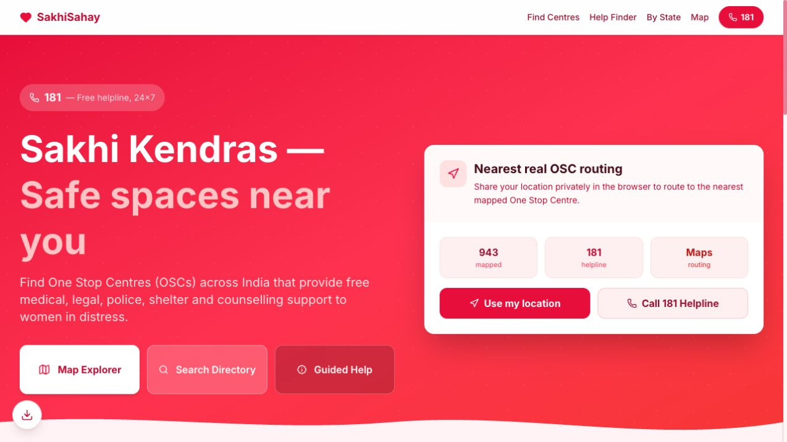

# SakhiSahay (sakhisahay.in)

[Open the live application →](https://sakhisahay.in)

[](https://opensource.org/licenses/MIT)

**SakhiSahay** is a lightweight, high-performance, and privacy-first digital bridge designed to streamline 24/7 access to One Stop Centres (OSCs / Sakhi Kendras) across India. 

One Stop Centres are a crucial initiative established by the Ministry of Women and Child Development (MWCD), Government of India, funded 100% by the **Nirbhaya Fund** under the **Mission Shakti** (Sambal sub-scheme) umbrella. They provide medical aid, police facilitation, temporary shelter, legal aid, and psycho-social counselling under one roof to women and girls facing domestic, economic, or digital violence.

---

[](https://sakhisahay.in)

## Why I built SakhiSahay

Someone very close to me experienced abuse in her marital life. Fear of social stigma made approaching authorities difficult, and she did not know where to turn.

While looking for help, I discovered One Stop Centres, also known as Sakhi Kendras. The support existed, but the digital journey was fragmented: information was spread across sources, some mobile apps I encountered required a login, and guidance was difficult to follow at a stressful moment.

I built and hosted SakhiSahay to bring discovery and guidance into one simple experience. My relative later used it to find support. She is now in safe hands and living peacefully. That personal experience is why this project matters to me.

Her identity and personal details are intentionally omitted.

## Three choices shaped by that experience

### 1. Let people explore without creating an account

**What I learned:** When someone is already hesitant to seek help, a login requirement adds another barrier.

**What I built:** Public access to centre search, maps, and guided help without registration, so visitors can explore support before deciding what to do.

### 2. Bring scattered information into one place

**What I learned:** Knowing that support exists is only the beginning. Finding the right centre, contact details, and directions across separate sources takes effort.

**What I built:** A connected experience with state and district directories, an interactive map, centre details, and navigation links.

### 3. Guide people from their situation to a next step

**What I learned:** Someone under stress needs simple guidance that starts with what they are facing.

**What I built:** A Guided Help Finder organised around needs such as medical help, shelter, legal support, and cyber harassment, with relevant services, checklists, and contact options.

[Try the Guided Help Finder →](https://sakhisahay.in/help-finder)

---

## 🛠️ Key Features

*   🗺️ **Interactive Map Explorer:** Visually search and route to the nearest One Stop Centre using official coordinate data, with standard Google Maps navigation linkage.
*   🧭 **Guided Help Finder:** A safe, non-linear helper tool. Survivors can select what best describes their situation (medical aid, police protection, legal counsel, child safety, cyber harassment) to get immediate action steps, ready checklists, and local helpline numbers.
*   🔍 **State & District Directories:** Clean, fast, and structured directory search by state/district index, providing direct phone numbers, email addresses, and locations.
*   🔒 **Privacy-First & Secure:** Zero user login required, zero tracking cookies, and client-side geolocation. Location-based centre discovery runs in the browser; users can also browse by state or district without sharing their location.
*   📱 **Progressive Web App (PWA):** Instantly installable on any iOS, Android, or desktop device, making the platform accessible offline and easy to access in a single tap on the home screen.

---

## 🏗️ Architecture & Tech Stack

This project is organized as a monorepo using **pnpm workspaces**:

| Directory | Package Name | Role | Tech Stack |
|---|---|---|---|
| `artifacts/sakhi-sahay` | `@workspace/sakhi-sahay` | Web Frontend | React, Vite, Leaflet Maps, TailwindCSS, Wouter |
| `artifacts/api-server` | `@workspace/api-server` | Backend API Server | Node.js, Express, TypeScript |
| `lib/db` | `@workspace/db` | Shared database | TypeScript (Compiled JSON assets) |

---

## 🚀 Getting Started

### Prerequisites
*   Node.js (v18+)
*   pnpm (v8+)

### Installation
Clone the repository and install all workspace dependencies from the root directory:
```bash
pnpm install
```

### Running Locally
To launch both the Vite development server (frontend) and the Express API server (backend) concurrently:
```bash
pnpm run dev
```
*   **Frontend Web:** `http://localhost:5173`
*   **Backend API:** `http://localhost:5000`

### Building for Production
To bundle the frontend build assets:
```bash
pnpm run build
```

### Verification & Linting
To perform static analysis and typechecking across all workspace modules:
```bash
pnpm run typecheck
```

---

## 🤝 Contributing

Contributions are welcome, especially in improving the discoverability and usability of the platform:

1.  **OSC Directory Updates:** If you notice an incorrect location, outdated phone number, or changed coordinator name, please update the database entry directly in:
    *   [oscs.ts](artifacts/api-server/src/data/oscs.ts)
2.  **Multilingual Support:** We want to translate the Guided Help Finder and landing pages into regional Indian languages (Hindi, Bengali, Telugu, Tamil, Marathi, etc.) to make it accessible to rural communities.
3.  **Performance Improvements:** Enhancing performance for low-bandwidth 3G/4G connections in rural areas.

---

## 📄 License

This project is licensed under the **MIT License** - see the LICENSE file for details. 
*Disclaimer: SakhiSahay is an independent community initiative helping survivors locate government resources and is not officially affiliated with the Ministry of Women and Child Development.*
